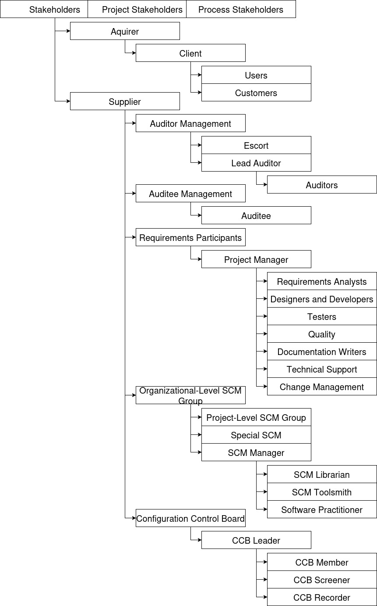

# Roles with Sources
## Introduction
This document lists the roles found in a software development project as found in Certified Software Quality Engineer Handbook 2009 by L Westfall. Each role is listed with an associated page number to reference the role description and context.

## List of Roles
* Stakeholders - CSQEHB Pg 72
* Project Stakeholders - CSQEHB Pg 72
* Process Stakeholders - CSQEHB Pg 72 - **All parties involved with the project fall under the stakeholders group.**

    * Aquirer - CSQEHB Pg 72 - **This group contains those who will eventually recive the product.**
        * Client - CSQEHB Pg 113
            * Users - CSQEHB Pg 73
            * Customers - CSQEHB Pg 73
    * Supplier - CSQEHB Pg 72 - **This group contains those who will be delivering the product which includes those in the supplying organization.**
        * Auditor Management - CSQEHB Pg 113
            * Escort - CSQEHB Pg 113
            * Lead Auditor - CSQEHB Pg 113
                * Auditors - CSQEHB Pg 113
        * Auditee Management - CSQEHB Pg 113
            * Auditee - CSQEHB Pg 113
        * Requirements Participants - CSQEHB Pg 182 - **This group contains those who will be working on the project in some capacity.**
            * Project Manager - CSQEHB Pg 183
                * Requirements Analysts - CSQEHB Pg 182
                * Designers and Developers - CSQEHB Pg 182
                * Testers - CSQEHB Pg 182
                * Quality - CSQEHB Pg 182
                * Documentation Writers - CSQEHB Pg 182
                * Technical Support - CSQEHB Pg 183
                * Change Management - CSQEHB Pg 183
        * Organizational-Level SCM Group - CSQEHB Pg 483 - **This group contains those who will manage the SCM.**
            * Project-Level SCM Group - CSQEHB Pg 483
            * Special SCM - CSQEHB Pg 485
            * SCM Manager - CSQEHB Pg 485
                * SCM Librarian - CSQEHB Pg 485
                * SCM Toolsmith - CSQEHB Pg 485
                * Software Practitioner - CSQEHB Pg 485
    * Configuration Control Board - CSQEHB Pg 524 - **This group contains those who will participate in the CCB.**
        * CCB Leader - CSQEHB Pg 525
            * CCB Member - CSQEHB Pg 525
            * CCB Screener - CSQEHB Pg 525
            * CCB Recorder - CSQEHB Pg 525

## Graphical Representation

## Citations
* Westfall, Linda. Certified Software Quality Engineer Handbook, ASQ Quality Press, 2009. ProQuest Ebook Central, http://ebookcentral.proquest.com/lib/byui/detail.action?docID=3002591.

